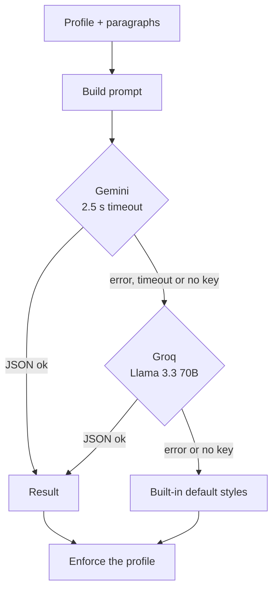

# Methodology

How AdaptAI decides what to change on a page: how your answers become a persona, how a page is scraped, how the AI providers are chained, how the profile overrides the model, and what happens when everything fails. Everything here is implemented in `extension/`.

[← Back to README](./README.md)

## Contents

1. [Persona from onboarding](#1-persona-from-onboarding)
2. [Page scraping](#2-page-scraping)
3. [The AI pipeline](#3-the-ai-pipeline)
4. [Profile enforcement](#4-profile-enforcement)
5. [Rule-based rewrite fallback](#5-rule-based-rewrite-fallback)
6. [Applying and restoring changes](#6-applying-and-restoring-changes)
7. [Motor assist and read-aloud](#7-motor-assist-and-read-aloud)
8. [Limitations](#8-limitations)

---

## 1. Persona from onboarding

Onboarding asks one visual question and one reading question, and builds a profile from the two answers. This is a lookup, not a measurement:

| Visual answer | Profile | Label shown |
| :--- | :--- | :--- |
| High contrast | `highContrast = true` | "High Contrast", score `45/100 (Assisted)` |
| Scaled text | `fontScale = 1.5` | "Large Typography", score `60/100 (Assisted)` |
| Standard | defaults | "Standard Visual", score `85/100` |

| Reading answer | Profile | Label shown |
| :--- | :--- | :--- |
| Dyslexia-friendly | `dyslexicFont = true` | "Dyslexia Assist", score `50/100 (Assisted)` |
| Simplified text | `simplifyText = true` | "AI Simplification", score `55/100 (Assisted)` |
| Original text | defaults | "Original Text", score `90/100` |

The persona name joins the two labels, for example "High Contrast + Dyslexia Assist Persona". The motor score is always `95/100`. The click test in onboarding shows your average time per click but does not feed the profile, and `motor.targetExpansion` starts as `false` and can be changed in the profile editor.

The scores are labels chosen from the options. They are not diagnostic results and must not be presented as medical or accessibility assessments.

## 2. Page scraping

The content script collects `
` elements that are not part of the extension's own UI, keeps those whose text is longer than 20 characters, and takes the **first 15**. Whitespace is collapsed. The payload sent to the service worker is the domain, the title and those paragraphs. Headings, lists and tables are not included.

## 3. The AI pipeline

**Prompt.** The system prompt states the persona, whether high contrast, a font scale, a dyslexia-friendly font and text restructuring are required, and the rules for rewriting: keep the same facts, names and numbers, do not write summaries or labels, and turn long passive sentences into clear, direct ones. The model must return JSON with these fields: `cssUpdates` (font scale, background and text colour), `simplifiedText` (one string per input paragraph), `dyslexicFont`, `motorAssist` and `voiceIntent`.

**Providers, in order.**

1. **Gemini** `gemini-1.5-flash` with a JSON response schema and temperature 0.2. The request is aborted after **2.5 seconds**.
2. **Groq** `llama-3.3-70b-versatile` with JSON mode. No timeout is set.
3. **Built-in defaults**: font scale 1.4, dark background `#09090b`, text `#f4f4f5`, line height 1.6 and no rewritten text.

A provider is skipped when its key is missing or still the placeholder. A failed Gemini call falls through to Groq silently.

## 4. Profile enforcement

Whatever the model returns, the saved profile wins. After the result arrives, the service worker overwrites it:

| Profile setting | Enforced result |
| :--- | :--- |
| High contrast on | Background `#09090b` and text `#f4f4f5` are forced |
| Font scale above 1.0 | `--adapt-font-scale` is set to the profile value |
| Line height set | `--adapt-line-height` is set to the profile value |
| Dyslexia-friendly font | `dyslexicFont` is set from the profile |
| Target expansion | `motorAssist` is set from the profile |
| Simplify text off | `simplifiedText` is emptied, so no text is changed |

This means the AI can only really influence the **wording** of rewritten paragraphs. The styling comes from your profile.

## 5. Rule-based rewrite fallback

If simplified text is requested but the AI returned nothing (no keys, offline, or both calls failed), the service worker rewrites the scraped paragraphs locally with four rules applied in order:

1. `; ` becomes `. `
2. `, which ` becomes `. This `
3. `, and furthermore ` becomes `. Also, `
4. Runs of whitespace are collapsed

This only splits long sentences. It does not simplify vocabulary, so expect modest changes without an AI key.

## 6. Applying and restoring changes

Styling is applied by setting CSS custom properties on the page root (`--adapt-font-scale`, `--adapt-bg-color`, `--adapt-text-color`, `--adapt-line-height`, `--adapt-font-family`) and attributes such as `data-adaptai-theme`. The theme is light only when the background is `#ffffff`, `#fff`, `white` or `#f4f4f5`, otherwise dark.

The OpenDyslexic font is loaded from the jsDelivr CDN the first time it is needed.

Before the first paragraph rewrite, the original text of every scraped paragraph is stored in memory. Pressing the shortcut again restores the original text, removes the added attributes, classes and styles, and cancels any speech. The cache lives in the page, so reloading the page also resets it.

The restore is triggered by the same shortcut, and that shortcut still scrapes the page and makes a full AI request first. The restore only runs when the response arrives, so a second press costs another API call and takes as long as the first.

## 7. Motor assist and read-aloud

- **Motor assist** adds a class to the page body. A stylesheet rule then gives buttons, submit and reset inputs, `role="button"` elements and navigation links a minimum height of 44 px, which is the common touch-target guideline. The extension's own widget is excluded.
- **Read-aloud** uses the browser's speech synthesis at its default rate of 1.0, with pause, resume and cancel.

## 8. Limitations

- Only 15 paragraphs are processed, and only `
` text is rewritten.
- The Gemini model name is fixed in code. A retired model makes that step fail and the pipeline falls to Groq.
- The Groq call has no timeout, so a slow response can delay the adaptation.
- The rule-based rewrite is very light.
- Persona "scores" are fixed labels, not measurements (§1).
- There is no evaluation of readability or comprehension gains. Whether a rewrite actually helps a reader has not been tested.
- Page text is sent to third-party AI providers when AI rewriting is on.
