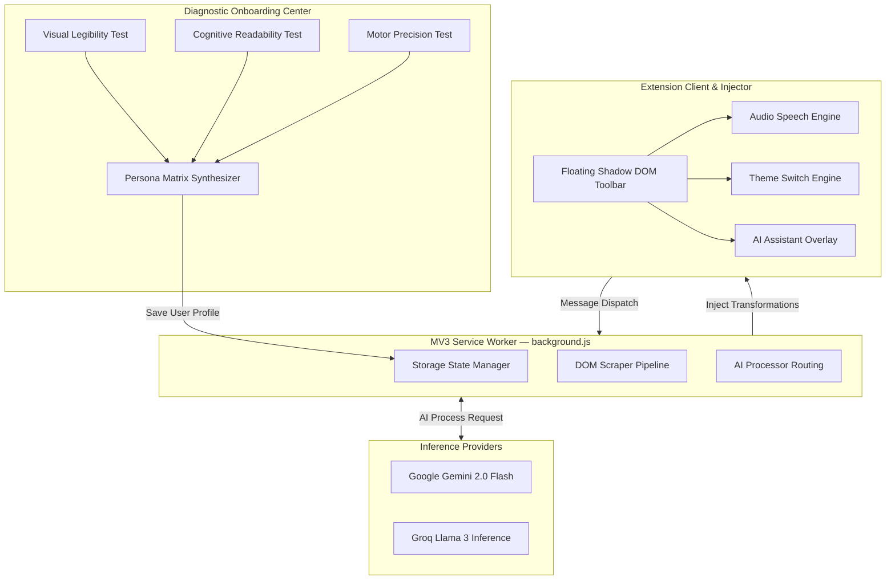
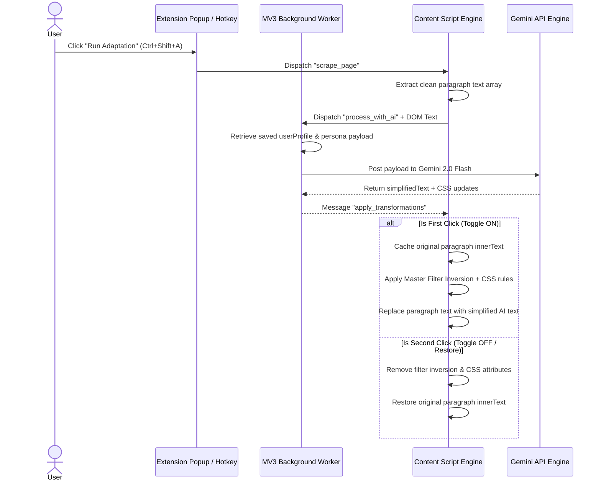
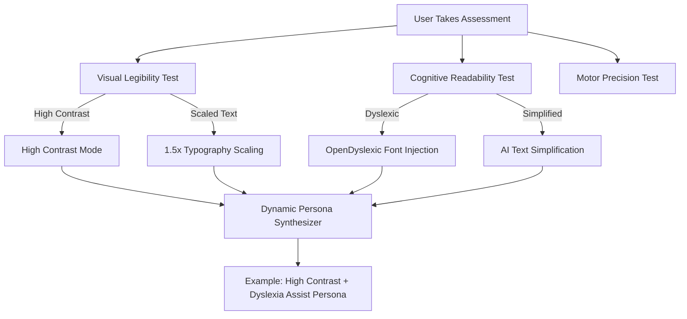

<div align="center">

# AdaptAI Intelligence & Accessibility Protocol

### Context & Persona-Aware Web Transformation & Reading Assist System

**`Chrome Extension MV3`** • **`JavaScript ES2024`** • **`CSS3 Luxury Zinc`** • **`Google Gemini 2.0 Flash`** • **`Groq Llama 3`** • **`Web Speech API`**

AdaptAI is an industry-grade accessibility protocol and browser extension engine designed to dynamically transform web typography, contrast, and cognitive density based on real-time user diagnostic profiling. Powered by Google Gemini AI, Groq LLM inference, and an open-source Filter Inversion Engine, AdaptAI eliminates digital reading barriers for users with low vision, light sensitivity, dyslexia, and cognitive overload.

---

[Getting Started](#getting-started) | [Architecture](#system-architecture) | [Core Features](#features) | [Persona Engine](#diagnostic-persona-matrix) | [API & AI Pipeline](#ai--neural-pipeline)

</div>

---

## Table of Contents

1. [System Architecture](#system-architecture)
2. [Tech Stack & Extensions Spec](#tech-stack)
3. [Getting Started & Local Setup](#getting-started)
4. [Core Features](#features)
5. [Diagnostic Persona Matrix](#diagnostic-persona-matrix)
6. [AI & Neural Pipeline](#ai--neural-pipeline)
7. [DOM Transformation & Filter Engine](#dom-transformation--filter-engine)
8. [Extension Configuration & Manifest Spec](#extension-manifest--storage)
9. [Project Structure](#project-structure)

---

## System Architecture

AdaptAI operates as a high-speed client-side DOM intelligence engine coupled with a Manifest V3 background service worker. It injects a zero-dependency Shadow DOM floating toolbar across host pages while communicating asynchronously with AI inference endpoints.

### High-Level Architecture



### Transformation & DOM Restore Execution Flow



---

## Tech Stack

| Layer | Technology | Purpose |
|-------|-----------|---------|
| **Extension Standard** | Manifest V3 (MV3) | Modern, secure Chrome/Brave/Edge extension standard |
| **Frontend UI** | HTML5 / CSS3 / Inter Typography | Glassmorphic luxury dark zinc interface styling (`#09090b`) |
| **Component Isolation** | Web Components (Shadow DOM) | Prevents host webpage CSS from breaking floating widget buttons |
| **AI LLM Engine** | Google Gemini 2.0 Flash / Groq | Real-time text simplification & contextual intent processing |
| **Theme Engine** | Smart Filter Inversion (`invert(0.92) hue-rotate(180deg)`) | Flawless dark mode adaptation without boxy outline artifacts |
| **Voice Speech** | Web Speech Synthesis API | Native browser text-to-speech audio reader |
| **Local Web Server** | Node.js `http-server` (Port 8080) | Local development workbench and test harness |

---

## Getting Started

### Prerequisites

- Google Chrome, Brave, Edge, or any Chromium-based browser supporting MV3.
- Node.js 18+ (for local http-server testing).

### Installation & Loading Extension

1. **Clone the Repository:**
   ```bash
   git clone https://github.com/ArrinPaul/AdaptAI.git
   cd AdaptAI
   ```

2. **Start Local Development Server:**
   ```bash
   npx --yes http-server . -p 8080
   ```

3. **Load Extension in Chrome:**
   - Open Chrome and navigate to `chrome://extensions/`.
   - Enable **Developer mode** (top right toggle).
   - Click **Load unpacked**.
   - Select the `AdaptAI/extension` folder inside this project directory.

---

## Features

### 1. Master Filter Inversion Engine

Industry-standard high-contrast adaptation engine that transforms any webpage layout into a sleek dark zinc theme without visual glitches or patchy outline boxes.

- **Flawless Full-Page Inversion**: Applies `invert(0.92) hue-rotate(180deg) contrast(1.08)` to the root element.
- **Smart Media Protection**: Automatically re-inverts photos (``), videos (`<video>`), vector graphics (`<svg>`), and canvas elements to preserve 100% natural image colors.

### 2. Dual-State DOM Adaptation (Toggle ON / Restore ORIGINAL)

- **First Click (`Run Adaptation` / `Ctrl+Shift+A`)**: Scrapes paragraph content, applies high-contrast styling, and injects AI-simplified summaries.
- **Second Click (`Run Adaptation` / `Ctrl+Shift+A`)**: Instantly restores the page back to its exact pre-adapted wording and original CSS layout.

### 3. Floating Shadow DOM Widget (`Audio`, `Theme`, `AI`)

Injected isolated pill toolbar positioned seamlessly on host pages:
- **`Audio`**: Triggers Web Speech Synthesis text-to-speech engine to read selected page paragraphs aloud.
- **`Theme`**: Instantly swaps host page color profiles between High-Contrast Dark Mode and Crisp Light Mode.
- **`AI`**: Toggles the interactive AI Assistant Overlay panel (`Ctrl+Shift+U`).

### 4. Interactive Extension Control Center (Popup)

- Compact **`350px`** wide popover.
- Displays the active dynamically synthesized User Persona title.
- One-click **Run Adaptation** trigger and master enable/disable switch.

---

## Diagnostic Persona Matrix

The Onboarding Assessment Center (`onboarding.html`) runs interactive diagnostic tests to build a custom multi-trait persona stored in `chrome.storage.local`:




---

## AI & Neural Pipeline

The background service worker (`background.js`) routes scraped DOM text payloads to Google Gemini 2.0 Flash:

```json
{
  "userProfile": {
    "personaName": "High Contrast + AI Simplification Persona",
    "visual": { "highContrast": true, "fontScale": 1.2 },
    "cognitive": { "dyslexicFont": false, "simplifyText": true }
  },
  "transformationData": {
    "simplifiedText": [
      "Simplified summary paragraph replacing complex academic text..."
    ],
    "cssUpdates": {
      "backgroundColor": "#121212",
      "textColor": "#FFFF00"
    }
  }
}
```

---

## Extension Manifest & Storage

Defined under Chrome Extension Manifest V3 (`extension/manifest.json`):

```json
{
  "manifest_version": 3,
  "name": "AdaptAI - Accessible Web Transformer",
  "version": "2.0.0",
  "permissions": [
    "activeTab",
    "storage",
    "scripting"
  ],
  "host_permissions": [
    "<all_urls>"
  ],
  "background": {
    "service_worker": "background.js",
    "type": "module"
  },
  "action": {
    "default_popup": "popup/popup.html"
  }
}
```

---

## Project Structure

```
AdaptAI/
├── extension/                       # Extension Core Directory
│   ├── manifest.json               # MV3 extension permissions & background script
│   ├── background.js               # Service Worker & AI Intelligence Pipeline
│   ├── content.js                  # Shadow DOM Floating Widget & Transformation Engine
│   ├── styles.css                  # Filter Inversion Engine & Typography Overrides
│   ├── popup/
│   │   ├── popup.html              # 350px Popover Control Center
│   │   └── popup.js                # State Synchronization & Trigger Handlers
│   ├── onboarding/
│   │   ├── onboarding.html         # Interactive Diagnostic Assessment Center
│   │   ├── onboarding.css          # High-Contrast Luxury Dark Zinc Styling
│   │   └── onboarding.js           # Dynamic Persona Matrix Synthesizer
│   └── profile/
│       ├── profile.html            # Saved Accessibility Preferences & Audit Panel
│       └── profile.js              # LocalStorage & Chrome Storage Sync
├── demo/
│   └── index.html                  # Local Workbench Test Page
├── index.html                      # Landing Page Documentation
└── README.md                       # Repository Documentation
```

---

<div align="center">

### Built for Universally Accessible Web Browsing

AdaptAI — Context & Persona Aware Assistant for Web Reading & Accessibility.

</div>

