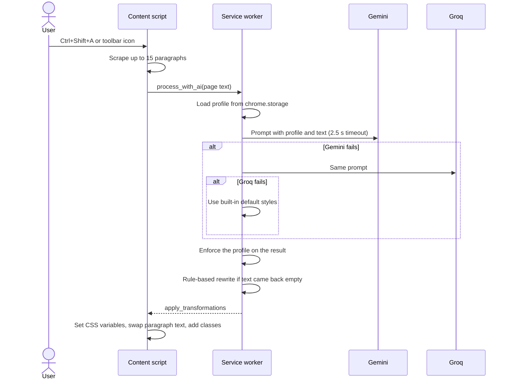

<div align="center">

# AdaptAI

### A Chrome extension that adapts web pages to how you read

_Contrast, text size, dyslexia-friendly fonts, plain-language rewriting and read-aloud, set once for every site._

[](LICENSE)


[Quickstart](#quickstart) · [Features](#features) · [How it works](#how-it-works) · [Methodology](./METHODOLOGY.md) · [Project status](#project-status) · [Report an issue](https://github.com/ArrinPaul/AdaptAI/issues)

</div>

---

## About

Most of the web assumes one kind of reader. AdaptAI lets you describe how you read best, then applies that to the pages you visit. During a short onboarding you choose a visual setting (high contrast or larger text) and a reading setting (dyslexia-friendly font or simplified text). The extension turns those choices into a saved profile and uses it on any page: it restyles the page, can rewrite paragraphs in plainer language with an AI model, reads text aloud and enlarges small click targets.

AI is optional and used in one place: rewriting paragraphs. It tries Google Gemini first, then Groq, and finally a simple rule-based rewrite, so the extension still works with no API key and no network.

**Who it's for:** people with low vision, dyslexia or cognitive-load difficulties, and anyone who finds dense pages hard to read.

> This is a prototype built for a hackathon. Read [Project status](#project-status) before relying on it, especially the notes on API keys.

## Table of Contents

1. [About](#about)
2. [Features](#features)
3. [Quickstart](#quickstart)
4. [How it works](#how-it-works)
5. [Using the extension](#using-the-extension)
6. [Tech stack](#tech-stack)
7. [Project structure](#project-structure)
8. [Privacy and security](#privacy-and-security)
9. [Testing](#testing)
10. [Project status](#project-status)
11. [Troubleshooting](#troubleshooting)
12. [Documentation](#documentation)
13. [Contributing](#contributing)
14. [License](#license)

## Features

| Area | What it does |
| :--- | :--- |
| **Onboarding** | A short setup that asks for your visual and reading preferences, includes a click-speed test, and builds a named persona such as "High Contrast + Dyslexia Assist Persona" |
| **Visual adaptation** | Dark high-contrast theme, font scaling (for example 1.5×) and line height, applied through CSS variables and reversible |
| **Reading support** | OpenDyslexic font, and AI or rule-based rewriting of up to the first 15 paragraphs into plain language, keeping the same facts |
| **Motor support** | Buttons, links and nav items are enlarged to at least 44 px tall when enabled |
| **Audio** | A read-aloud button using the browser's speech synthesis, with pause and resume |
| **Floating widget** | A small control panel in a Shadow DOM, so page styles cannot break it. It has read-aloud, theme and assistant buttons. |
| **Assistant panel** | A small prompt box that runs the same adaptation pipeline with your request added. It shows the first rewritten paragraph back. It is not a general question-and-answer chat. |
| **Restore** | Pressing the shortcut again puts the page back as it was, including the original paragraph text (it first repeats the AI request, so it is not instant) |
| **Shortcuts** | `Ctrl+Shift+A` adapts the page. `Ctrl+Shift+U` opens the assistant. (`Command` on Mac.) |
| **Profile editor and popup** | Change your profile, switch the extension on or off and see your active persona |

## Quickstart

Prerequisites: Google Chrome (or another Chromium browser) and, optionally, a [Gemini API key](https://aistudio.google.com/) and a [Groq API key](https://console.groq.com/).

```bash
git clone https://github.com/ArrinPaul/AdaptAI.git
cd AdaptAI
```

**1. Create your key file (required).** The service worker imports `extension/env.js`, which is deliberately not in the repository. Without the file the extension will not load. Copy the template and fill in your keys, or leave the placeholders to run without AI:

```bash
cp extension/env.example.js extension/env.js
```

**2. Load the extension.**

1. Open `chrome://extensions` and turn on **Developer mode**.
2. Click **Load unpacked** and choose the `extension/` folder.
3. A setup tab opens on first install. Pick your preferences and save.
4. Open any article, then press `Ctrl+Shift+A` or click the toolbar icon.

After changing `env.js`, press the reload icon on the extension card in `chrome://extensions`.

**3. Optional: serve the repo for the popup links.** The toolbar popup's menu (landing page, profile editor, demo) opens pages from `http://localhost:8080/`, so those links only work while the repository root is served on that port:

```bash
python -m http.server 8080      # run from the repository root
```

The onboarding page opens by itself on install, and the profile editor is also reachable at `chrome-extension://<your-extension-id>/profile/profile.html` without a server.

The repository root also has two static pages you can open in a browser: `index.html` (a landing page) and `demo/index.html` (a simulation of the adaptations on sample text).

## How it works


```mermaid
sequenceDiagram
    actor U as User
    participant C as Content script
    participant B as Service worker
    participant G as Gemini
    participant Q as Groq
    U->>C: Ctrl+Shift+A or toolbar icon
    C->>C: Scrape up to 15 paragraphs
    C->>B: process_with_ai(page text)
    B->>B: Load profile from chrome.storage
    B->>G: Prompt with profile and text (2.5 s timeout)
    alt Gemini fails
        B->>Q: Same prompt
        alt Groq fails
            B->>B: Use built-in default styles
        end
    end
    B->>B: Enforce the profile on the result
    B->>B: Rule-based rewrite if text came back empty
    B-->>C: apply_transformations
    C->>C: Set CSS variables, swap paragraph text, add classes
```

- **Content script** (`content.js`) scrapes the page, applies results and hosts the widget and assistant. Original paragraph text is cached so the page can be restored.
- **Service worker** (`background.js`) builds the prompt, calls the AI providers and makes sure the saved profile always wins over what the model returned.
- **Profile** lives in `chrome.storage.local`. Nothing is sent to a server of this project.

The persona rules, the AI fallback chain and the rewrite fallback are explained in [METHODOLOGY.md](./METHODOLOGY.md).

## Using the extension

1. Finish onboarding once (it reopens if you skip it).
2. On a page, press `Ctrl+Shift+A`. Press it again to restore the original page (this repeats the AI request before restoring).
3. Use the floating widget for read-aloud, the light and dark theme, and the assistant.
4. Open the toolbar popup to switch the extension off and see your persona. Its menu links need the local server from the Quickstart.

## Tech stack

| Layer | Technology |
| :--- | :--- |
| Platform | Chrome Extension, Manifest V3 (service worker, content script, popup) |
| Language | Plain JavaScript (ES modules in the service worker), HTML and CSS |
| AI | Google Gemini REST API (`gemini-1.5-flash`), Groq API (`llama-3.3-70b-versatile`) |
| Browser APIs | `chrome.storage`, `chrome.commands`, `chrome.tabs`, Web Speech synthesis, Shadow DOM |
| Fonts | OpenDyslexic (loaded from the jsDelivr CDN) |
| Build | None. There is no bundler or package manager. |

## Project structure

```text
AdaptAI/
├── extension/
│   ├── manifest.json       Permissions, shortcuts, content script and service worker
│   ├── background.js       Service worker: prompts, Gemini and Groq calls, profile enforcement
│   ├── content.js          Page scraper, DOM changes, widget, assistant, restore
│   ├── styles.css          Variables, themes, dyslexic font and motor-assist styles
│   ├── popup/              Toolbar popup
│   ├── onboarding/         First-run setup and persona builder
│   ├── profile/            Profile editor
│   ├── demo/               Controlled test page for trying the adaptations
│   └── env.example.js      Template for the required, git-ignored env.js
├── demo/index.html         Standalone simulation page
├── index.html              Landing page
├── docs/                   Planning notes written during the hackathon
├── METHODOLOGY.md
└── LICENSE
```

## Privacy and security

- **Your profile stays on your device**, in `chrome.storage.local`.
- **Page text is sent to Gemini or Groq** when you adapt a page with AI rewriting turned on. Do not use it on pages with private content.
- **Your API keys are readable by anyone who has the extension.** They are loaded from `env.js` into the extension itself, and Gemini calls put the key in the request URL. Use throwaway or restricted keys, and do not publish a built copy with real keys.
- **Broad permissions.** The extension runs on all sites (`<all_urls>`) so it can adapt any page.

## Testing

There is no automated test runner. The code includes two self-check suites you run by hand:

- Content script: open a page with the extension loaded, then run `window.__runTrackATests()` in the page console.
- Service worker: open the service worker console from `chrome://extensions` and run `runTrackBTests()`.

The `extension/demo/index.html` page is a controlled page for checking the adaptations visually.

## Project status

AdaptAI is a working prototype built in about a week. Things to know:

- **Popup links need a local server.** The menu in the popup opens `http://localhost:8080/...` URLs, so the profile editor, landing page and demo links fail unless you run a server on that port.
- **`env.js` is required** and is not committed, so a fresh clone does not load until you create it (see [Quickstart](#quickstart)). The old `.env.example` is not used by the code.
- **The "diagnostic scores" are labels, not measurements.** Onboarding sets fixed values such as "45/100 (Assisted)" depending on the option you pick. The click-speed test shows your average time but does not change your profile.
- **The Gemini model name `gemini-1.5-flash` is hard-coded.** If Google retires it, the Gemini step fails and the extension falls back to Groq or the built-in defaults. Update the model name in `background.js`.
- **Only the first 15 paragraphs** (longer than 20 characters) are scraped and rewritten.
- **Keys are exposed to anyone with the extension** (see [Privacy and security](#privacy-and-security)).
- **No automated tests or CI**, and no extension icons are set in the manifest.

## Troubleshooting

| Symptom | Likely cause | Fix |
| :--- | :--- | :--- |
| "Service worker registration failed" on `chrome://extensions` | `extension/env.js` is missing | Copy `extension/env.example.js` to `extension/env.js`, then reload the extension. |
| Pages adapt but text is never rewritten | AI rewriting is off in your profile, or no keys are set | Turn on simplified text in the profile editor, and add a valid key to `env.js`. |
| Rewritten text looks like the original with a few sentence breaks | Both AI calls failed, so the rule-based rewrite ran | Check your keys, the network and the model name. |
| The popup's profile, landing or demo link opens an error page | The links point to `http://localhost:8080/` | Run `python -m http.server 8080` from the repo root, or open the profile editor through its `chrome-extension://` URL. |
| Nothing happens on `Ctrl+Shift+A` | The extension is off, or onboarding is not finished | Open the popup and switch it on, or complete onboarding. |
| It does not work on a particular page | Chrome blocks extensions on `chrome://` pages and the Web Store | Try a normal website. |

## Documentation

| Document | Purpose |
| :--- | :--- |
| [METHODOLOGY.md](METHODOLOGY.md) | Persona rules, AI pipeline, fallbacks and restore behaviour |
| [docs/MasterPlan_V2.md](docs/MasterPlan_V2.md) | The original build plan |
| [docs/tracker.md](docs/tracker.md) | Task tracking from the hackathon |

## Contributing

Issues and pull requests are welcome. Please keep changes small, never commit `extension/env.js` or any API key, and describe how you tested the change (the extension has no test runner, so mention the page you tried it on).

## License

Released under the MIT License. See [LICENSE](LICENSE).
